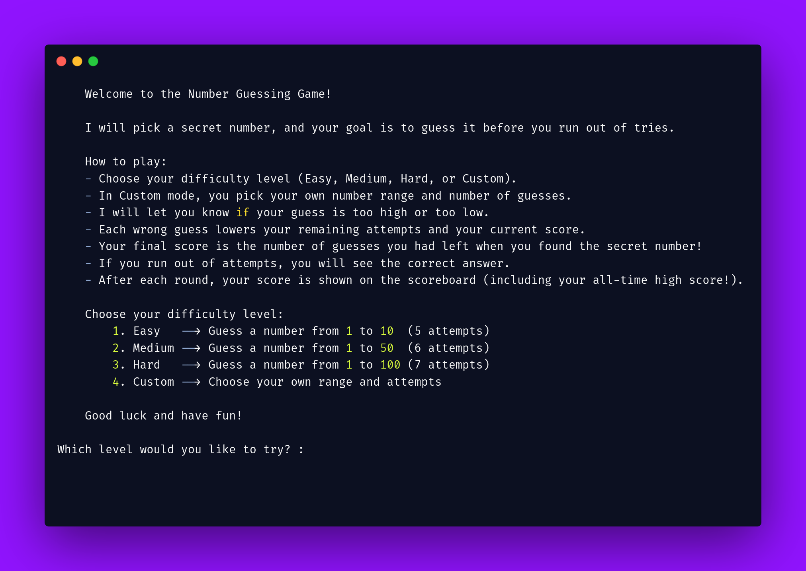

# 🎯 Number Guessing Game

A fun and interactive **Number Guessing Game** built in Python!  
Test your luck and logic by guessing the correct number within a limited number of attempts.

---

## 📸 Screenshots  
  


## 📜 How to Play

1. **Choose a difficulty level**:
    - 🟢 Easy:    Guess a number between 1 to 10 (5 attempts)
    - 🟡 Medium:  Guess a number between 1 to 50 (6 attempts)
    - 🔴 Hard:    Guess a number between 1 to 100 (7 attempts)
    - ⚙️ Custom:  Set your own number range and number of attempts

2. **Gameplay**:
    - You'll be given a range and a set number of attempts.
    - Guess the number correctly before attempts run out.
    - You'll get hints like **"Too high"** or **"Too low"** after each wrong guess.
    - A correct guess earns you a score based on remaining attempts.

3. **Scoring**:
    - Final score = Number of attempts remaining when you guess the number.
    - A scoreboard is maintained after every round.
    - Your **high score** is tracked across all rounds.

---

## 📦 Features

- ✅ Four levels of difficulty (Easy, Medium, Hard, Custom)
- ✅ Validates all user inputs
- ✅ Prevents out-of-range guesses
- ✅ Scoreboard that shows previous scores and the high score
- ✅ Option to play multiple rounds
- ✅ Fully terminal-based (no GUI)

---

## 🛠️ How to Run

Make sure Python is installed on your machine.

1. Clone the repository or download the Python file.
2. Open your terminal or command prompt.
3. Navigate to the directory where the script is located.
4. Run the game with:

```bash
python3 main.py
```
